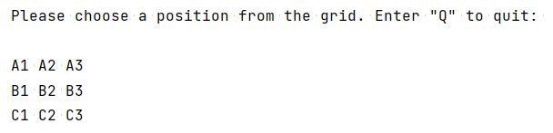
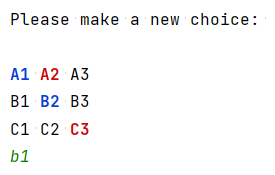
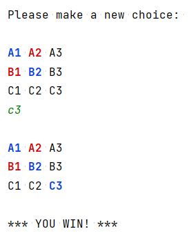

# Tic-Tac-Toe
First attempt at creating a **Tic-Tac-Toe game** played against the CPU on the console. The game displays a grid, and the choices are colored after they are made. The program is also prepared to deal with illegal inputs and other unwanted situations. Wins are checked at every turn, and CPU choices are randomized at this moment.

**TO DO:** Implement an AI algorithm for the CPU, such as Minimax.
